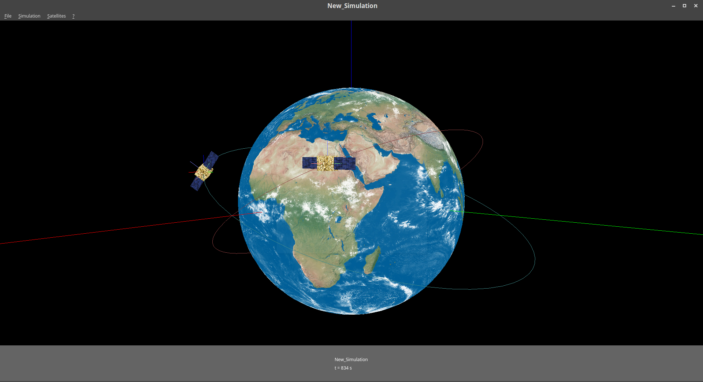

# SatelliteSimulator

A simple Qt/OpenGL satellite orbit simulator.



## Build instructions

To build this project, you will need the **Qt5** and **Qt5 OpenGL** libraries. To install them on a Debian-based system :

```
$ sudo apt install qt5-default qttools5-dev-tools libqt5opengl5-dev
```

Then, generate the Makefile with `qmake`:

```
$ qmake
```

Before compiling, you will have to tell the compiler to use the **GLU** library. To achieve this, **modify the Makefile** and add `-lGLU` at the end of the line of the Makefile which starts with `LIBS`. The line should be:
```
LIBS          = $(SUBLIBS) -L/usr/X11R6/lib64 -lQt5OpenGL -lQt5Widgets -lQt5Gui -lQt5Core -lGL -lpthread -lGLU
```

Finally, compile and run the executable:

```
$ make && ./SatelliteSimulator
```

## Quickstart

Create a new simulation with `File > New simulation` or `Ctrl+N` and configure it by changing orbital parameters or planet texture if you want. Then add a couple of satellites with `Satellites > Add new satellite` or `Ctrl+A`, and hit the space bar to start/pause it. The satellites can be configured or removed in the Satellites menu.

Note: for having the satellites move faster on the screen, increase the speed factor in the simulation parameters.

To save the current state, save your simulation with `File > Save simulation` or `Ctrl+S`, so you can continue it later by opening the simulation file (`.sim` extension) with `File > Open existing simulation` or `Ctrl+O`.